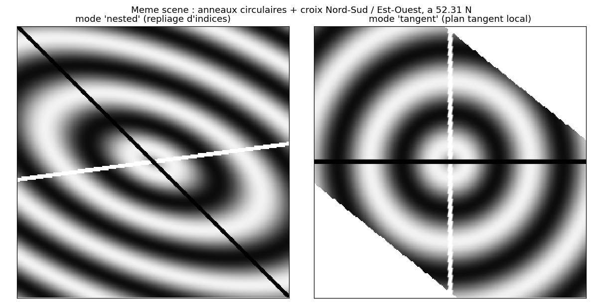

# `GetDINOV3SAT` — DINOv3 embeddings of HEALPix data

**Module** `healpix_analyse.dino`  
**Function** `GetDINOV3SAT`  
**Status** experimental

---

## Overview

`GetDINOV3SAT` computes DINOv3 (SAT-493M) embeddings of Sentinel-2-like data
stored on a NESTED HEALPix grid, **without modifying the network**. Each
HEALPix cell of `parent_level` gives one square image; the images go through an
unmodified backbone and the patch tokens come back attached to positions on the
sphere.

How that image is built is the decisive choice, and there are two modes.

### `projection="tangent"` (default)

Each tile is resampled onto a north-up gnomonic plane tangent at the cell
centre, at a constant ground sampling -- the construction `fft_local.LocalFFT`
already uses for the local FFT.

This is not a refinement, it is a correctness fix. HEALPix cells have equal
**area** but not equal **shape**: inside a base face the two NESTED axes are
neither orthogonal nor of equal length, and the distortion grows with latitude.

| latitude | nested step x | nested step y | angle(x, y) | anisotropy |
|---|---|---|---|---|
| 0 deg | 12.52 m | 12.52 m | 99.3 deg | 1.18 |
| 30 deg | 12.48 m | 12.48 m | 82.9 deg | 1.13 |
| **52.3 deg** | **10.63 m** | **16.72 m** | **60.5 deg** | **2.05** |
| 70 deg | 10.23 m | 16.88 m | 63.5 deg | 2.03 |

(at level 19; the ratios do not depend on the level.) At the latitude of the
demo store, the "square" image of the `nested` mode is really a parallelogram
stretched by a factor 2 and sheared by 30 degrees: a circle on the ground
arrives as a tilted ellipse. A network trained on ordinary map-projected
imagery cannot be expected to see through that.



*The same synthetic scene at 52.3 N -- concentric rings plus a north-south /
east-west cross. Left: `nested`. Right: `tangent`.*

The image is sized to contain the whole cell, which is a parallelogram, so it
is rectangular and a little larger than the cell: a 256-px nested block at
52.3 N needs a 448 x 320 tangent image.

**The output still tiles the sphere exactly.** The tokens sit on a square
metric grid while the cells are parallelograms, so assigning each token to the
cell it falls in would give some cells two tokens and others none -- a moire of
holes on a map. The module goes the other way: it enumerates the cells of the
token level inside each tile (they tile it exactly, by construction) and reads
the token field at their positions. Every cell carries exactly one embedding,
`patch_cell_id` is the complete set of children of the tiles, and
`patch_lon` / `patch_lat` are the cell centres.

The price: two resamplings (data to the tangent grid, tokens back to the
cells), so nothing is exact any more. Tiles at the edge of the domain do not
reach `coverage == 1`, since the rectangle draws on neighbouring cells that are
missing there; interior tiles do.

### `projection="percell"`

One tangent plane **per output cell**. For every cell of `parent_level` a
north-up image of `context_px` pixels is built, tangent at that cell's centre,
and the embedding is the patch token holding the centre (`pooling="cls"` for
the whole window instead). The window is centred exactly on the cell, in the
cell's own frame, so nothing is interleaved and nothing is resampled back: this
is the exact sliding window. `level - parent_level >= 4` no longer applies --
the cell may be finer than a patch.

`parent_level` is the output level here: one embedding per cell of that level,
which is the original contract of the function.

The cost is one forward pass per cell instead of one per tile -- for a
4-million-cell scene with cells at `level - 3` that is 65 536 passes against 64,
three orders of magnitude. Use `out_cells` to run it on a small area, compare
against `projection="tangent"` with `over_sample`, and keep the cheap one for
production if the difference does not matter for your task.

### `projection="nested"`

The purely combinatorial mode. A cell of `parent_level` contains exactly
`4**(level - parent_level)` cells of `level`, stored contiguously and ordered
by a Morton (Z-order) code of their local face coordinates, so a NESTED block
*is* a square image of side `S = 2**(level - parent_level)`, with no
resampling, and every 16 x 16 patch token maps back to exactly one cell of
`level - 4`. Exact in index space, wrong in geometry away from the equator.
Kept so the two can be compared.

```
level 19 cells  --tangent_tiles-->  tiles [M, 3, 256, 256]  --DINOv3-->  CLS [M, 1024]         (one per level-11 cell)
                                                                        patches [M*256, 1024]  (one per 160 m patch)
```

### `over_sample` -- sliding window

By default the 16 x 16 patches are laid side by side, exactly as the network
does. `over_sample=n` (a power of two) runs the network `n**2` times on windows
shifted by `16 / n` pixels and **interleaves** the tokens -- they do not
overlap in the output, each lands at a distinct position -- giving a token
field `n` times denser in each direction, at `level - 4 + log2(n)`. Cost grows
as `n**2`. In tangent mode the shift is applied to the projection grid, so
nothing is lost at the borders; in nested mode the shifted window is cropped
from the tile, which costs one patch of border and leaves the token centre half
a cell off the cell it is reported in.

Compared with running DINOv3 on UTM tiles, the embeddings live directly on the
sphere: hierarchical for free, and comparable across dates and orbits because
the grid never changes.

---

## Signature

```python
GetDINOV3SAT(
    data,                     # [N, C] reflectances in [0, 1], NaN = missing
    cell_id,                  # [N] NESTED ids at `level`
    level,                    # resolution of `data`
    parent_level,             # resolution of the DINO tiles, level - parent_level >= 4
    model          = None,    # backbone from load_dinov3_sat(); loaded if None
    weights        = None,    # .pth path (torch-hub) or HF id
    model_name     = "dinov3_vitl16",
    bands          = (0, 1, 2),          # (R, G, B) columns of data — S2: B04, B03, B02
    mean           = SAT493M_MEAN,
    std            = SAT493M_STD,
    pooling        = "cls",              # "cls" | "mean" | "cls+mean"
    return_patches = False,
    min_coverage   = 0.0,
    fill           = "mean",             # missing pixels: per-tile mean | "zero"
    batch_size     = 16,
    device         = None,
    autocast       = True,
) -> DINOEmbedding
```

| Field of `DINOEmbedding` | Shape | Meaning |
|---|---|---|
| `embedding` | `[M, Ndino]` | one vector per tile of `parent_level` present in `cell_id` |
| `cell_id` | `[M]` | NESTED ids of those tiles |
| `coverage` | `[M]` | fraction of `level` pixels available in each tile |
| `patch_embedding` | `[M·P, Ndino]` | patch tokens (`return_patches=True`) |
| `patch_cell_id` | `[M·P]` | NESTED ids of the patches at `patch_level = level - 4` |

`Ndino` is 1024 for ViT-L/16 (`pooling="cls+mean"` doubles it).

---

## Choosing `parent_level`

| `level - parent_level` | tile side | patch tokens | comment |
|---|---|---|---|
| 4 | 16 px | 1 | one patch per tile — no context, avoid |
| 6 | 64 px | 4 × 4 | small context, many tiles |
| **8** | **256 px** | **16 × 16** | close to the 224–256 px training regime, recommended |
| 10 | 1024 px | 64 × 64 | 4096 tokens, quadratic attention cost |

For Sentinel-2 at level 19 (≈ 10 m), `parent_level = 11` gives 256 px tiles
of ≈ 2.5 km and patch embeddings on level-15 cells (≈ 160 m).

---

## Missing pixels, duplicate cells and memory

**Missing pixels.** A `parent_level` cell is rarely covered completely: pixels
absent from `cell_id`, and NaN values, are replaced before the forward pass by
the per-tile, per-band mean (`fill="mean"`) or by zero (`fill="zero"`).
`coverage` reports the fraction of real pixels of each tile.

Filler is invented data, and DINOv3 embeds it like any other texture: a
partly-empty tile produces an embedding that says as much about the filling
strategy as about the ground, which pollutes any clustering built on top.
**Use `min_coverage=1.0` to keep only complete tiles** — no missing cell, no
NaN, hence no filler at all. That is the default of the example script. Lower
it (0.9, 0.5) only when clouds would otherwise leave too few tiles, and expect
the clusters to degrade accordingly.

**Duplicate cell ids.** Data projected from another grid (UTM, swath, ...)
regularly puts two source pixels in the same HEALPix cell, so the same id
appears twice in `cell_id`. Such rows are averaged (NaN-aware) with a
`RuntimeWarning`; `duplicates="first"` keeps the first occurrence and
`duplicates="error"` restores a hard failure.

**Memory.** Patch tokens are numerous: a level-19 store cut into 256 px tiles
gives one 1024-d vector per level-15 cell *and per date*. For a 4-million-cell
store over 88 dates that is about 5.9 GiB in float32. Restrict the dates,
store them as float16, or take larger tiles — the example script prints the
estimate before starting and warns above 4 GiB.

---

## The tile effect

A ViT's attention is global: every patch token attends to the whole tile. So a
tile-wide radiometric offset — thin cloud, cirrus shadow, sun angle — lands in
*every* token of that tile. Cluster the tokens and you get one cluster per tile,
with the tile boundaries plainly visible on the map. This is not a HEALPix
artefact; it would happen with any tiling.

`GetDINOV3SAT` returns the tokens as the network produced them and does not
correct this, because the right correction depends on what you are after. Three
options, applied by the example script and notebook:

- subtract each tile's mean token (`--token-norm tile`, the default there).
  Effective, but it makes the description *relative to each tile*: a fully
  forested tile and a fully urban one become comparable, so genuine
  tile-scale differences are lost too;
- drop the leading principal components (`--token-norm pc`), gentler, since the
  first one usually carries illumination;
- use larger tiles (`--tile-levels 10`), which leaves fewer boundaries.

Measure before you correct: the script prints the fraction of token variance
carried by the per-tile mean, and §5 of the notebook does the same. Above ~0.5,
any clustering will follow the tiling. A hazy date will always produce tokens
dominated by the haze — picking a clear date is the first remedy.

---

## Orientation and geometry

Inside a HEALPix base face the local axes are rotated by 45° with respect to
East/North: the north corner of a face is at `(x, y) = (max, max)`. Tiles are
built with `row = S - 1 - y`, `col = x`, so North points to the top-right
corner. The orientation is the same for all tiles of one face and rotated on
the polar faces. For a satellite backbone (no gravity direction) this is a
mild effect; when fine-tuning, use rotation augmentations rather than image
flips. Pixel-shape distortion of HEALPix cells (equal area, variable shape)
is negligible at the scale of a 16 px patch.

---

## Getting the weights (required step)

The SAT-493M checkpoints are **gated**: `healpix-analyse` never downloads
them, and calling `GetDINOV3SAT` / `load_dinov3_sat` without `weights`
raises an error on purpose. Without it, torch-hub would silently fall back to
the *web* checkpoint (`lvd1689m`, a different model) and fail with
`HTTP Error 403: Forbidden` anyway.

**Route A — torch-hub (recommended)**

1. Request access on Meta's DINOv3 download page,
   <https://ai.meta.com/resources/models-and-libraries/dinov3-downloads/>,
   and accept the **DINOv3 License**. You receive personalised download URLs
   by e-mail (they expire after a few days).
2. Download the satellite ViT-L/16 checkpoint,
   `dinov3_vitl16_pretrain_sat493m-<hash>.pth` (≈ 1.2 GB), and copy it to the
   machine where you run the code (e.g. Datarmor).
3. Pass its path as `weights`:

   ```python
   model = load_dinov3_sat("dinov3_vitl16",
                           weights="/path/to/dinov3_vitl16_pretrain_sat493m-<hash>.pth")
   ```

   or, for the example script,
   `python Notebooks/dino_umap_sentinel2.py --weights /path/to/dinov3_vitl16_pretrain_sat493m-<hash>.pth`.

   `weights` also accepts the personalised URL directly. The DINOv3 code is
   fetched by `torch.hub` from `facebookresearch/dinov3` on first use (cached in
   `~/.cache/torch/hub/`); on a machine without internet access, clone that
   repository and pass its path as `repo=` / `--repo`.

**Route B — Hugging Face**

1. Accept the licence on the model page
   <https://huggingface.co/facebook/dinov3-vitl16-pretrain-sat493m>.
2. `pip install transformers` and `huggingface-cli login`.
3. `load_dinov3_sat("dinov3_vitl16", source="hf")` or
   `python Notebooks/dino_umap_sentinel2.py --hf`.

To test the pipeline without any weights, use `--fake` (random backbone: the
embeddings are meaningless, only the HEALPix plumbing is exercised).

---

## Example

```python
import xarray as xr
from healpix_analyse.dino import GetDINOV3SAT, load_dinov3_sat

ds = xr.open_zarr("https://data-taos.ifremer.fr/EGU25_CFOSAT/Sentinel2_test.zarr")   # level 19
rgb = ds.Sentinel2.isel(time=0).sel(bands=["b04", "b03", "b02"]).transpose("cells", "bands").values / 1e4

model = load_dinov3_sat("dinov3_vitl16", weights="dinov3_vitl16_pretrain_sat493m-eadcf0ff.pth")
res = GetDINOV3SAT(rgb, ds.cell_ids.values, level=19, parent_level=11,
                   model=model, return_patches=True, min_coverage=0.5)

res.embedding.shape        # (M, 1024)   one per level-11 cell
res.patch_embedding.shape  # (M*256, 1024)  one per level-15 cell -> res.patch_cell_id
```

`Notebooks/dino_tuning_single_date.ipynb` is the companion notebook: one date,
every parameter exposed at the top, and the expensive steps (download, forward
pass) separated from the cheap ones, so `K` can be re-tuned by re-running a
single cell. It also shows the tiles as the network sees them, a PCA of the
patch tokens (the standard check that the features mean anything at all), and a
comparison against a k-means on colour alone.

### Reading the demo store reliably

One date of the demo store is a single zarr chunk of a few hundred MB served
over plain HTTP, and the server does drop connections
(`aiohttp ServerDisconnectedError`). The example script therefore retries each
date with an exponential back-off (`--retries`, 5 by default), can keep every
date locally as float16 (`--cache DIR`) so an interrupted run resumes without
downloading it again, and can carry on past a date that never arrives
(`--skip-failed`). A robust first run:

```bash
python Notebooks/dino_umap_sentinel2.py \
    --weights /path/to/dinov3_vitl16_pretrain_sat493m-<hash>.pth \
    --times 0:10 --cache ~/s2_cache --skip-failed
```

`Notebooks/dino_umap_sentinel2.py` runs this on all 88 dates of the demo
store, projects the patch tokens with UMAP, clusters them with k-means and
draws the cluster maps next to the RGB scene in lon/lat with `healpix_plot`
(unsupervised classification test; needs `healpix-plot`, `cartopy`, `umap-learn`,
`scikit-learn`). `--fake` runs the whole pipeline with a random backbone when the
weights are not available.

---

## Licence and provenance — please read

`healpix-analyse` is released under the **Apache License 2.0**. This module
is an independent, HEALPix-only adapter and is deliberately kept separate
from the model it calls:

- **No DINOv3 code is copied or vendored** in this package. The backbone is
  loaded at run time from Meta's own distribution — the
  [`facebookresearch/dinov3`](https://github.com/facebookresearch/dinov3)
  torch-hub repository or the `facebook/dinov3-*` Hugging Face models — via
  `torch.hub.load` / `transformers.AutoModel`.
- **No DINOv3 weights are redistributed.** The SAT-493M checkpoints are
  gated: you must request them from Meta and accept the **DINOv3 License**
  (see `LICENSE.md` in the DINOv3 repository and the model cards on Hugging
  Face) before downloading. `healpix-analyse` never downloads them for you
  and never ships them.
- **The network is not modified** — no architecture change, no fine-tuning,
  no re-implementation. This module only reorders HEALPix cells into images
  (`nested_to_tiles`) and maps the tokens back to cells (`tile_grid_cell_ids`);
  these helpers are original code, useful with any 16-px-patch ViT.
- The use you make of the DINOv3 model and of its outputs is governed by the
  DINOv3 License, not by the Apache licence of this package. Check that your
  use case (research, commercial, redistribution of derived products) is
  permitted by that licence, and cite the DINOv3 paper
  (Siméoni et al., 2025, *DINOv3*, arXiv:2508.10104) when publishing results
  obtained with it.

The normalisation constants `SAT493M_MEAN` / `SAT493M_STD` are the values
published in the DINOv3 model card for the satellite models; verify them
against the version of the model you download.
